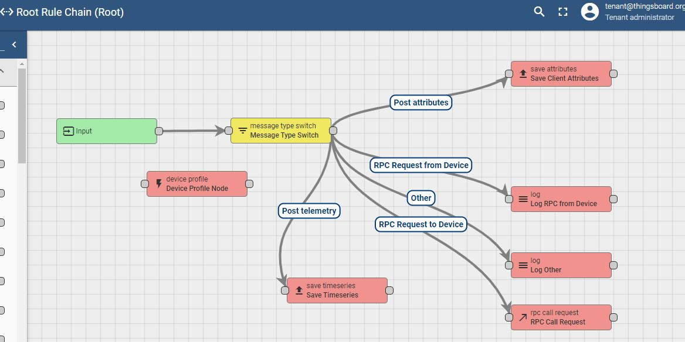
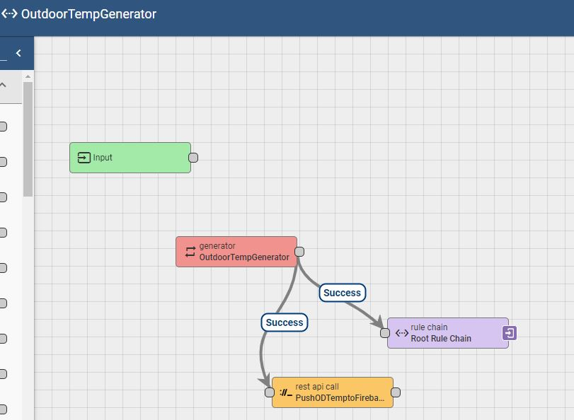
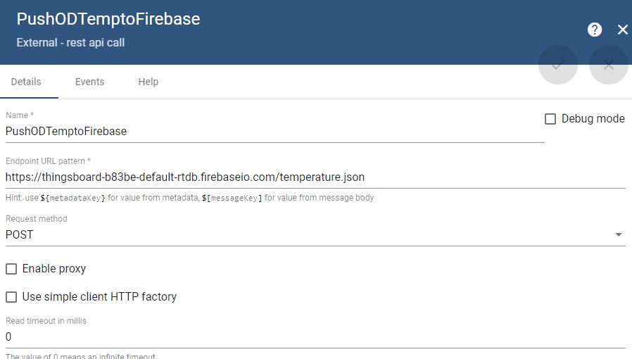
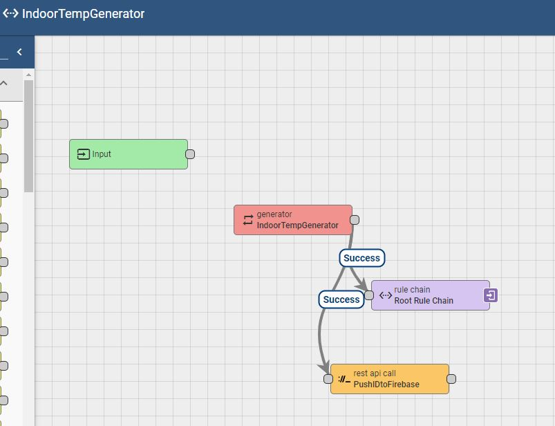
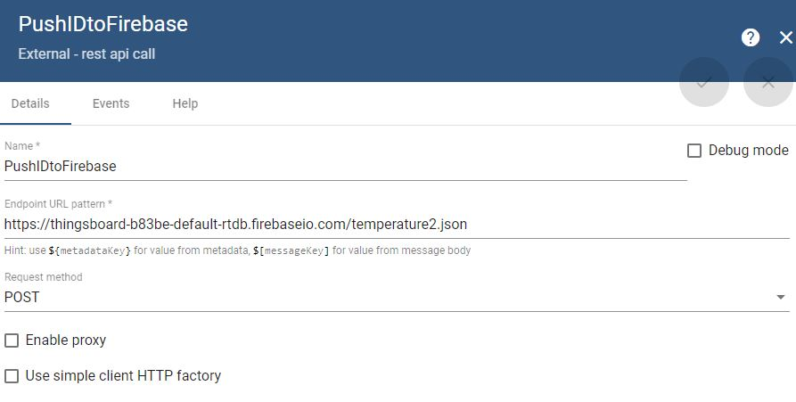
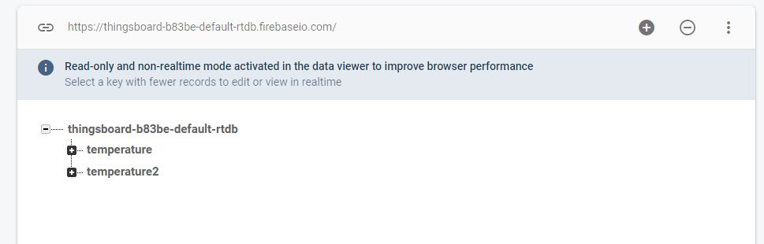
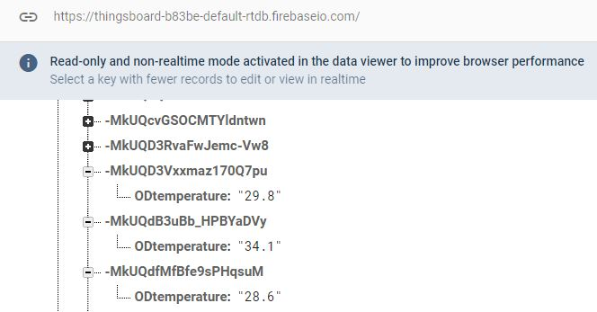
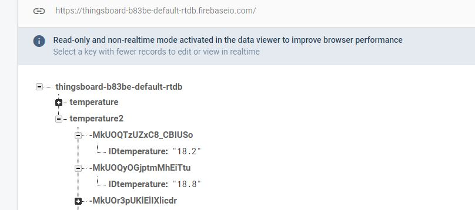
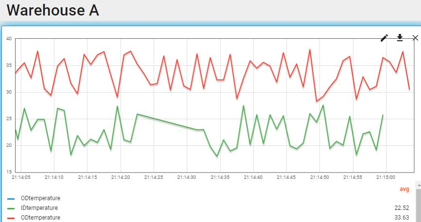

# Thingsboard
## HW2 for MIT 1.125
### Question 1: Immages of rule chains
*For the Root Rule chain, no major change to the default. The basic function is to pusblish the data to the device telemetry*
    

Two Generators were used to generate outdoor and indoor temperatures respectively
- *Outdoor Generator rule chain image*
  
  
  Code for the outdoor generator: 
  > var msg = {
  >            	ODtemperature: (28 + 10 * Math.random()).toFixed(1)
  >           };
  >           
  >           return {
  >           	msg: msg,
  >           	metadata: {
  >           		deviceType: "outdoor thermometer"
  >           	},
  >           	msgType: "POST_TELEMETRY_REQUEST"
  >           };
  
  
  push to firebase is achieved with the "rest api call"
  
- *Indoor Generator rule chain image*
  
  
  Code for the indoor generator: 
  
  >
  > var msg = {
  >           	IDtemperature: (18 + 10 * Math.random()).toFixed(1)
  >           };
  >       
  >           return {
  >           	msg: msg,
  >           	metadata: {
  >           		deviceType: "indoor thermometer"
  >           	},
  >           	msgType: "POST_TELEMETRY_REQUEST"
  >           };

  push to firebase is achieved with the "rest api call"
  
  
### Question 2: Image of Firebase
Two data channels were setup in firebase realtime database to record the indoor and outdoor temperature:

  
  
- The outdoor temperature datachannel in Firebase realtime database is named "temperature"
    
    
- The indoor temperature datachannel in Firebase realtime database is named "temperature2"
    

### Dashboard view of indoor and outdoor temperatures

The outdoor temperature should be 10 degrees higher than indoor by design. 

  
